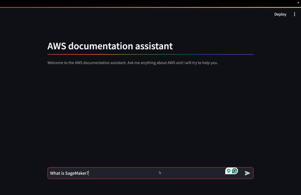
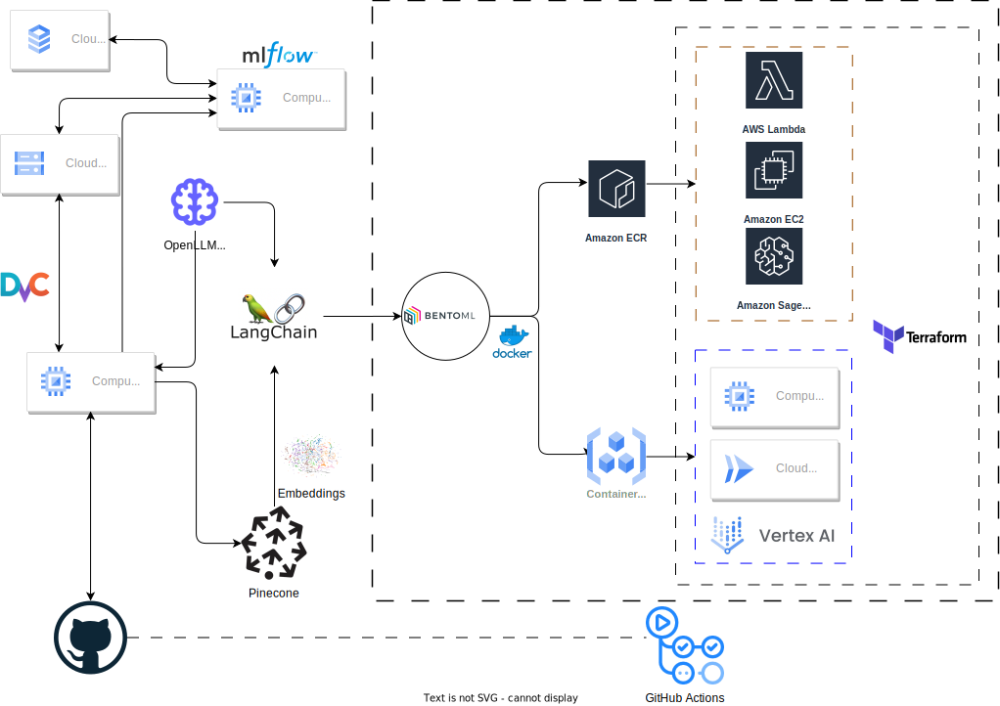
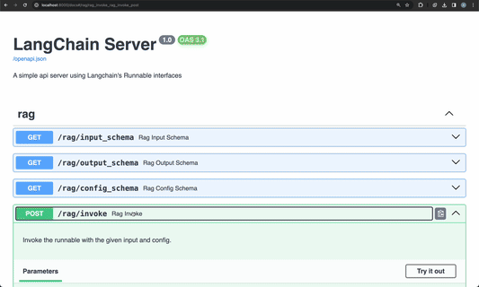

# LLM - Retrieval-Augmented Generation *aka* `RAG` <!-- omit in toc -->
This project is part of the interviewing process for the position of Machine Learning Engineer. The goal of the project is to build a question answering system using a language model able to answer questions about the content of the documents provided.



## Table of Contents <!-- omit in toc -->

- [Architecture](#architecture)
- [Installation](#installation)
- [Test](#test)
- [Data](#data)
  - [Data Version Control](#data-version-control)
  - [Extract, transform, load](#extract-transform-load)
- [Model](#model)
  - [Experiments](#experiments)
  - [Registry](#registry)
  - [Serving](#serving)
- [Deployment](#deployment)
- [Monitoring](#monitoring)
- [References](#references)

## Architecture

The architecture of the project is shown below:



## Installation

To install the project, run the following command:

```bash
make install
make download_models
```

## Usage

To use the project, run the following command:

```bash
make run_frontend
```

Then, open the browser and go to `http://localhost:8501/` to use the application.


You can also try the REST API using the following command:

```bash
make run_rest_api
```

Then, open the browser and go to `http://localhost:8000/docs` to use the application.



## Test

Before running any test, pull the test data from remote using the following command:

```bash
dvc pull datasets/test
```

To test the project, run the following command:

```bash
make test
```

## Data

The data is stored in the `datasets` folder. The data is stored in the following format:

```
datasets
├── test
│   └── ...
├── raw
│   └── ...
├── interim
│   └── ...
└── processed
    └── ...
```

The `raw` folder contains the raw data. The `interim` folder contains the data after it has been cleaned. The `processed` folder contains the data after it has been processed and is ready for use in a model. The `test` folder contains the data used for testing.


### Data Version Control

The data is versioned using `DVC`. The data is stored in a remote GCP bucket. It works like git, its commands are similar. For instance, the data stored in `datasets` can be added using the following command:

```bash
dvc add datasets/
```

Then, the data can be pushed to remote using the following command:

```bash
dvc push
```

The data can be pulled from remote using the following command:

```bash
dvc pull
```

### Extract, transform, load

The ETL process consists of the following steps:

- `extract`: Reads the files matching the `datasets/raw/*.md` glob pattern.
- `transform`: The documents are split and chunked into a specified length. The chunks are then vectorized using the `GPT4All` embedding model.
- `load`: The embeddings are uploaded to a `Pinecone` index.

## Model

Models are pre-trained, open-sourced and can be accessed using the `GPT4All` library. The model experiments and evaluation are logged in the `MLFlow` server. Two models were evaluated:

- `orca-mini-3b-gguf2-q4_0`: This model requires a machine with 4GB of RAM and its weights are about 1.84GB.
- `gpt4all-falcon-q4_0`: This model requires a machine with 8GB of RAM and its weights are about 3.92GB.

Further information about the models can be found in [GPT4All](https://gpt4all.io/index.html).

The LLMs listed above are able to answer questions on topics on which they have been trained. But they are not able to answer questions on personal data or documents written after the LLM was trained. Then, `RAG` comes as a solution to this problem. `RAG` is a combination of a `LLM`, a `retriever` and a `prompt` template. These parts are described below:

- `Retriever`: The `retriever` provides chunks of the documents that are relevant to the question. It is a vector database that stores the `embeddings` of the documents. The retriever is used to retrieve the documents that are relevant to the question. The retriever was implemented using `Pinecone`.
- `LLM`: The `LLM` is then used to answer the question based on the retrieved documents. The `LLM` is a language model that is able to answer questions about the content of the documents. The `LLM` was implemented using `GPT4All`.
- `Prompt`: The `prompt` provides rules and a structure to answer the question. The retrieved documents are used as context. The `prompt` is shown below:
    > You are an assistant for question-answering tasks. Use the following pieces of retrieved context to answer the question. If you don't know the answer, just say that you don't know. Use three sentences maximum and keep the answer concise.
    **Question**: { question }
    **Context**: { context }
    **Answer**:

### Experiments

The models where evaluated using some example queries related to the content of the documents:

- What is SageMaker?
- What are all AWS regions where SageMaker is available?
- How to check if an endpoint is KMS encrypted?
- What are SageMaker Geospatial capabilities?

The following metrics were used to evaluate the models:

- `Latency`: The time it takes to get a response from the model.
- `Toxicity`: The toxicity of the response. It regards hate speech, offensive language, insults, and profanity.
- `ARI grade`: The ARI grade of the response. It regards the readability of the response. This test indicates the grade level at which readers can understand the text.
- `Flesch-Kincaid grade`: The Flesch-Kincaid grade of the response. It regards the readability, it is a test designed to indicate how difficult a passage in English is to understand

The model `output` was stored as well, it is used to subjectively evaluate the quality of the response.

The `GPT falcon` model performed better than the `Orca model` in all metrics, but latency. The `GPT falcon` model was chosen to be used in the application.


### Registry

The models are saved using `BentoML`. The models can be listed using the following command:

```bash
bentoml list
```

### Serving

The serving of the model is done using `BentoML`, to serve the model, run the following command:

```bash
bentoml serve src/serving/frontend.py
```

## Deployment

The deployment of the application is done using `BentoML` and `Terraform`. BentoML is cloud agnostic, it can be deployed to any cloud provider. The deployment of the application involves several steps, start by building the bento model.

```bash
bentoml build
```
It is necessary to install the `aws-sagemaker` operator for `bentoctl`, as follows:

```bash
bentoctl operator install aws-sagemaker
```

Then initialize the `bentoctl` project.

```bash
bentoctl init
```

You should get a similar output:

```bash
api_version: v1
name: rag-app
operator:
  name: aws-sagemaker
template: terraform
spec:
  region: us-east-1
    instance_type: ml.t2.medium
    initial_isntance_count: 1
    timeout: 60
    enable_data_capture: false
    destination_s3_uri:
    initial_sampling_percentage: 1
env:
```

Then two files should be created:

- `main.tf`: This file contains the terraform code to deploy the application to `Sagemaker`.
- `bentoctl.tfvars`: This file contains the configuration of the application.
- `deployment_config.yaml`: This file contains the configuration of the application.

Then, build the application using the following command:

```bash
bentoctl build deployment_config.yaml -b tinyllm:latest
```

Then, initialize the terraform project using the following command:

```bash
terraform init
```

Then apply the terraform code using the following command:

```bash
terraform plan -var-file=bentoctl.tfvars
terraform apply -var-file=bentoctl.tfvars
```

To destroy the application, run the following command:

```bash
terraform destroy -var-file=bentoctl.tfvars
```

## Monitoring

A way to monitor the model in production is to use adversarial validation. Should use `Pinecone` to store predictions embeddings. The procedure is shown in the image below:


## References

- [GPT4All](https://gpt4all.io/index.html)
- [Pinecone](https://www.pinecone.io/)
- [BentoML](https://docs.bentoml.org/en/latest/)
- [FastAPI](https://fastapi.tiangolo.com/)
- [MLFlow](https://mlflow.org/)
- [DVC](https://dvc.org/)
- [GitHub Actions](https://docs.github.com/en/actions)
