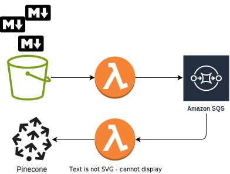

# Solution

1. Does your solution solve the company’s pain points? What are they?

- The solution provides a way for developers to quickly get answers to their questions without having to interrupt other developers or search through documentation.
- The solution provides a single source of truth for information, which reduces the risk of developers receiving outdated information.
- The solution can point users to relevant documentation, which can help them learn more about a topic and find additional resources.

2. What is the name of the LLM Pattern you’ve used in this project? Since names are not yet standardized, feel free to elaborate on the pattern you used.

Retrieval-Augmented Generation (RAG). RAG helps reduce hallucination by grounding the model on the retrieved context, thus increasing factuality. In addition, it’s cheaper to keep retrieval indices up-to-date than to continuously pre-train an LLM. This cost efficiency makes it easier to provide LLMs with access to recent data via RAG. Finally, if we need to update or remove data such as biased or toxic documents, it’s more straightforward to update the retrieval index (compared to fine-tuning or prompting an LLM not to generate toxic outputs).

3. What tools did you use? Why did you select them?

The tools used for this project include:
- Python: Python is a popular programming language for machine learning and natural language processing.
- DVC: DVC is a version control system.
- MLFlow: MLFlow is useful to track, register and evaluate machine learning models.
- Langchain: Langchain is a Python library for building language models.
- Pinecone: Pinecone is a vector database that can be used to store and retrieve vectors.
- BentoML: BentoML is a Python library for packaging and deploying machine learning models.

The tools were selected based on the following criteria:

- Reliability: The tools are well-established and have been used successfully in other projects.
- Performance: The tools are efficient and can be used to train and deploy large language models.
- Accessibility: The tools are open-source and can be easily installed and used.

The cloud provider used for this project is GCP. It was selected based on the following criteria:

- I had some free credits!

However, all the infrastructure used in this project can be easily deployed on AWS or any other.

4. What model would you use for this use case? Why?

I tried two:

- GPT4 Falcon: It is the heaviest of the two, also the most recent and the most powerful. It is also the most expensive to serve.
- Orca Mini: It is the lightest of the two. It is also the cheapest to serve.

Both models are is instruction based and can be used for question answering. Both have been quantizated to reduce the size of the model and the inference time. It is fine to use quantizated and state-of-the art models. There is no need to have the best model for this use case. The goal is to provide a solution that is cheap to serve and that can be easily deployed, and also guide the user to the right documentation.

5. What did you use for your embeddings? How does that decision affect the performance of your system?

GPT4All was used to generate the embeddings. The idea is to use an embeddings model that was trained on similar data, or in curated, high-quality data. The embeddings model used in this case was GPT4AllEmbeddings that provides embeddings comparable in quality to those of OpenAI. It is also fast in CPU, and it is only 45MB in disk!

A bad election of the embeddings model can affect the performance of the system. For example, if the embeddings model is too big, it will take longer to generate the embeddings. On the other hand, if the embeddings model is too small, the quality of the embeddings will be poor.

On the other hand, Pinecone, a vector database, was used to store and retrieve the embeddings. Pinecone was selected because it is a managed service, which means that it is easy to deploy and maintain. Using this does not comply with the requirement of geographical restrictions. The solution would be to deploy the application to a cloud provider and restrict the access to the API Gateway to the US only.

6. How does your system handle out-of-vocabulary (OOV) terms?

OOV terms are handled by the embeddings model. The embeddings model is trained on a large corpus of text, which means that it can handle OOV terms. At this level of abstraction, there is no control over the OOV terms. The embeddings model can be considered as a black box.

At the end of the day, embeddings are the ones that capture the meaning/context of the text. Even if there are OOVs in the text, the embeddings reduce data in a high dimensional space to a smaller one where the semantics and the most meaningful information is preserved.

7. Would you need to self-host? Explain your decision.

It is not ideal, even suboptimal, to self-host the application. The application should be deployed to a cloud provider. The application can be deployed to AWS or any other cloud provider. On the other hand, regarding the geographical restrictions,[AWS Cloud CloudFront](https://docs.aws.amazon.com/AmazonCloudFront/latest/DeveloperGuide/georestrictions.html) can help making it accessible only within the US for both the S3 bucket and the API Gateway.

8. How did you chunk the documents provided? Does this decision have any effect on the performance of the system?

There is no clear answer here. Most of the questions we make in ML field inherently takes to say: depends! Chunking the documents is a trade-off between the size of the chunks. If chunks are too small or too large it may lead to imprecise search results or missed opportunities to surface relevant content. As a rule of thumb, if the chunk of text makes sense without the surrounding context to a human, it will make sense to the language model as well.

The documents are markdown files, then the nature of the file might be considered. For example, I considered to chunk the document by sections. Also, I considered to chunk the document by length. In the end, I decided to chunk the document by length because it is easier to implement and it is more flexible.

9. What is missing for your solution to be production-ready?

I wanted to try `BentoML` for this application, but there is no straightforward way to bentonize a RAG model. The problem is that there is no way to wrap the RetrievalQA object as a BentoService. The solution would be to create a custom BentoService, but it would require a lot of work.

A workaround is to manually dockerize the application and model, then deploy it using any compute. And include the process in GHA.

10. Is your system able to handle changing information? What would happen if the documentation is updated?

The current solution in only able to push a batch of embeddings to the index. The problem increases when the number of documents increases. The solution would be to implement a pipeline that is triggered when a new document is uploaded, a document is deleted or a document is updated.

Supposing that the documentation is stored in a bucket, the following steps would need to be taken:

- Bucket triggers a notification to a Pub/Sub topic when a new document is uploaded.
- Pub/Sub topic triggers a Lambda that:
    - Downloads the document if it is new, or it was updated.
    - Splits the document into chunks.
    - Vectorizes the chunks.
    - Uploads/Update/Delete the embeddings to a Pinecone index.

11. How can you evaluate your system?

Metrics, metrics, metrics and more metrics!

 - How do you evaluate your information retrieval system?
Metrics like toxicity, ARI Grade, Lesch Grade, etc. can be used to evaluate the quality of the generated answers. I used MLFlow to automate the evaluation and facilitate the comparison between different LLMs.
 - What would need to be different between evaluation during development and for production?
The evaluation would be done on the production data. The evaluation would be done on a daily basis to ensure that the model is performing as expected.
In a production environment we tend to measure latency, downtime, load capacity. But I also propose to measure the concept drift using an adversarial model. The idea is to train a model to detect the concept drift and trigger an alert when it happens.
